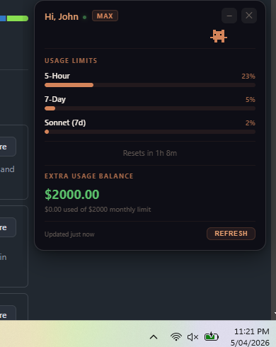

<div align="center">

# Prominence

### A desktop HUD for Claude Code power users

Track your usage limits, reset countdowns, and extra usage balance in real time.




[Download](#download) | [Quick Start](#quick-start) | [Features](#features) | [Auto-Launch](#auto-launch-with-claude-code)

</div>

---

## Why Prominence?

If you use Claude Code daily, you've probably hit a usage limit without warning. Prominence fixes that. It's a tiny floating HUD that stays on your screen and shows you exactly where you stand, so you can pace your usage and avoid surprises.

## Features

| Feature | Description |
|---------|-------------|
| **Usage bars** | 5-hour and 7-day limits with color-coded progress (green / yellow / red) |
| **Per-model breakdown** | Opus, Sonnet, and other model-specific usage when available |
| **Reset countdown** | Exact time until your limits refresh |
| **Extra usage balance** | Remaining monthly overage credits at a glance |
| **Plan detection** | Automatically shows your Pro or Max plan |
| **Activity indicator** | Pixel character walks when Claude Code is running, idles when it's not |
| **Glass HUD** | Dark frosted glass card with Claude orange accents |
| **Draggable** | Position the HUD anywhere on screen |
| **Auto-refresh** | Updates every 5 minutes with manual refresh button |
| **Single instance** | Relaunching just refreshes the existing HUD |
| **Auto-launch** | Optionally starts with every Claude Code session |
| **Lightweight** | ~60MB memory, lives in system tray |

## Download

Grab the latest installer from [**Releases**](https://github.com/3stanKyle/prominence/releases):

| Platform | File |
|----------|------|
| Windows  | `Prominence-Setup-x.x.x.exe` |
| macOS    | `Prominence-x.x.x.dmg` |
| Linux    | `Prominence-x.x.x.AppImage` |

## Quick Start

### From installer

Download, install, run. Click the pixel character in your system tray to open the HUD.

### From source

```bash
git clone https://github.com/3stanKyle/prominence.git
cd prominence
npm install
npm start
```

### Requirements

- [Claude Code](https://claude.ai/code) installed and logged in (`claude login`)
- An active **Claude Pro** or **Max** subscription
- Node.js 18+ (if running from source)

## Auto-Launch with Claude Code

Add this to `~/.claude/settings.json` to start Prominence automatically with every Claude Code session:

```json
{
  "hooks": {
    "SessionStart": [
      {
        "matcher": "startup",
        "hooks": [
          {
            "type": "command",
            "command": "npm start --prefix /path/to/prominence &",
            "timeout": 5
          }
        ]
      }
    ]
  }
}
```

Replace `/path/to/prominence` with your install path. The single-instance lock means relaunching just refreshes data.

## How It Works

```
                          ┌─────────────────────────┐
~/.claude/.credentials.json │                         │
        │                   │   Floating Glass HUD    │
        │ OAuth token       │                         │
        ▼                   │   Hi, John  [MAX]  - x  │
┌──────────────┐            │   ░░░░░░░░░░░░░░░░░░░░  │
│  Anthropic   │  usage %   │   5-Hour        23%     │
│  OAuth API   │──────────▶ │   ████░░░░░░░░░░░░░░░░  │
│  /api/oauth/ │            │   7-Day          5%     │
│    usage     │            │   █░░░░░░░░░░░░░░░░░░░  │
└──────────────┘            │                         │
                            │   Resets in 4h 23m      │
                            │   Extra: $2000 left     │
                            └─────────────────────────┘
```

Prominence reads your existing OAuth token from `~/.claude/.credentials.json` and calls `api.anthropic.com/api/oauth/usage` directly. No extra API keys needed.

## Usage

| Action | How |
|--------|-----|
| Open HUD | Click tray icon |
| Move HUD | Drag the title bar |
| Refresh | Click `REFRESH` or tray menu |
| Minimize | `–` button (hides to tray) |
| Close | `x` button (hides to tray) |
| Quit | Right-click tray > Quit |
| Keyboard | `Escape` to close |

## Project Structure

```
src/
  main/
    index.ts          # App lifecycle, IPC handlers, auto-refresh
    tray.ts           # System tray icon and context menu
    overlay.ts        # Floating HUD window management
    usageService.ts   # Anthropic API client for usage data
    preload.ts        # Secure IPC bridge for renderer
  renderer/
    index.html        # HUD UI: glass card, progress bars, pixel character
```

## Development

```bash
npm install          # install dependencies
npm start            # compile + launch
npm run typecheck    # type check only
npm run build        # package for distribution
```

### Creating a release

Tag a version to trigger the GitHub Actions build:

```bash
git tag v0.1.0
git push origin v0.1.0
```

This builds Windows `.exe`, macOS `.dmg`, and Linux `.AppImage` and attaches them to the GitHub Release automatically.

## Privacy

Prominence only talks to `api.anthropic.com` using your existing Claude Code token.

- No telemetry or analytics
- No third-party services
- No credential storage (reads from `~/.claude/` which Claude Code manages)
- Fully open source

## Contributing

PRs welcome. Run `npm run typecheck` before submitting.

## License

[MIT](LICENSE)

---

<div align="center">

Built by [3stanKyle](https://github.com/3stanKyle) for the Claude Code community.

</div>
